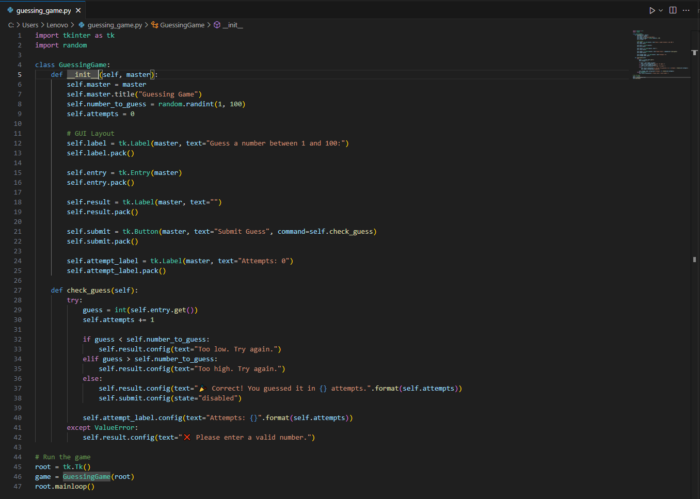
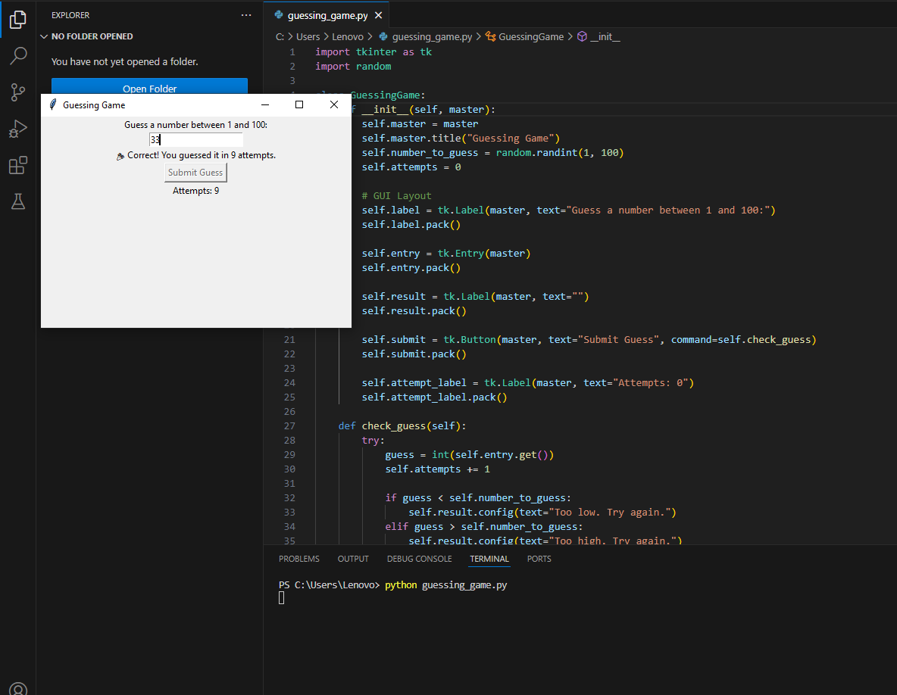
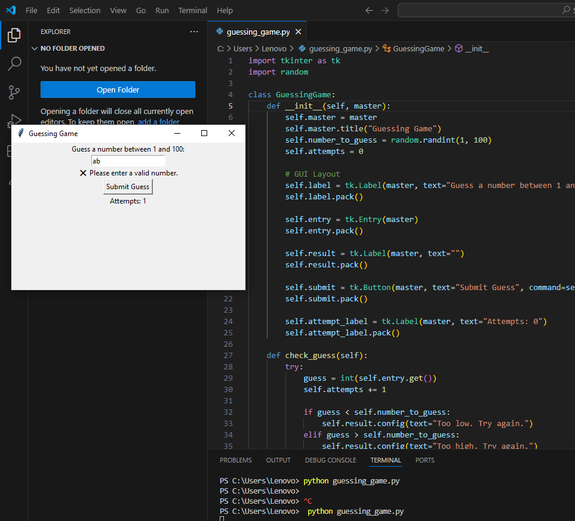

# 🎯 Task-02: Guessing Game — Prodigy Infotech Internship

This project is built as part of my internship at *Prodigy Infotech*.

## 🧠 Project Description

The goal of this project is to create a simple and interactive number guessing game using *Python with a GUI* made in *Tkinter*.

### 🔹 Features:
- Randomly generates a number between 1 and 100
- Takes user input via entry field
- Tells if the guess is too high or too low
- Shows total attempts when the user wins
- Clear layout and interactive messages

---

## ▶️ How to Run

### ✅ Requirements:
- Python 3.x installed on your system

### 💻 Steps to Run:
python guessing_game.py

## 📸 Screenshots

### 1️⃣ Code Interface
This shows the main Python script (guessing_game.py) opened in VS Code.

### 2️⃣ User Input + Output Example
Here, the user guess the numbers and gets the attempted result.

### 3️⃣ Error Handling
Demonstrates the program handling invalid input (like alphabets) with an error message.

